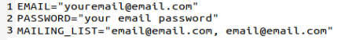

# The weekly meal planner

Beta version of a tool that generates a customizable meal plan out of a large dataset of screapped recipes

### Technology stack 

Python (BeautifulSoup, pandas, numpy, dotenv, smtplib, email.mime), json, DigitalOcean. 

### Inspiration 

Grocery shopping takes time and effort, but unplanned grocerry shopping takes even longer. When we make meal plans, we reduce the number of visits to the supormarket and the money that we spend, and we can enhance the balance of our diet and be more creative in our cooking. Planning your weekly meal brings a lot of benefits but it can also be a time consuming and tiring process. This tood does the work for you. 

After scraping over 10k recipes from the website [Link](http://www.recetasgratis.net), you can set up out preferences using the separate json file. The tool then will send you via email a selection of 7 meals and 7 dinners for hte week. 

### Configuration 

If you know me, and you'd like to have your name added to the distribution list of the weekly meal plan, let me know! On the other hand, you can also set the tool up in your own terminal. To do this, after cloning the repo, you'll need to create a file called .env and update it with the following information: 

### Folder structure

Don't forget to set up a `.env` file. This program requires a sender and recipient email to deliver the results. 

### To Do 

